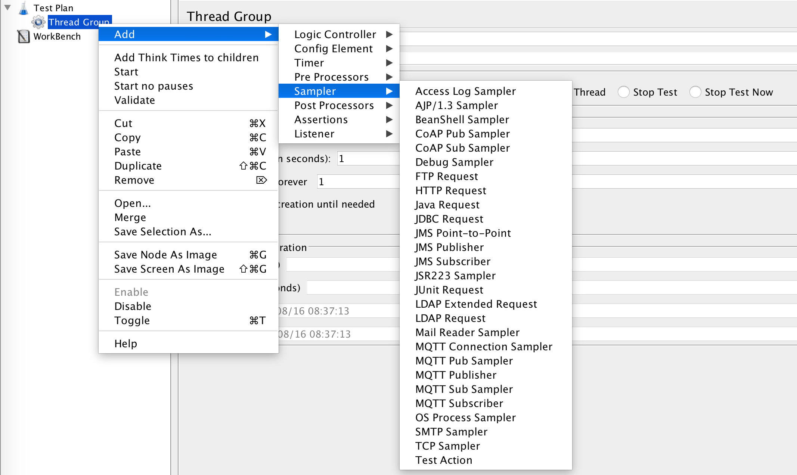
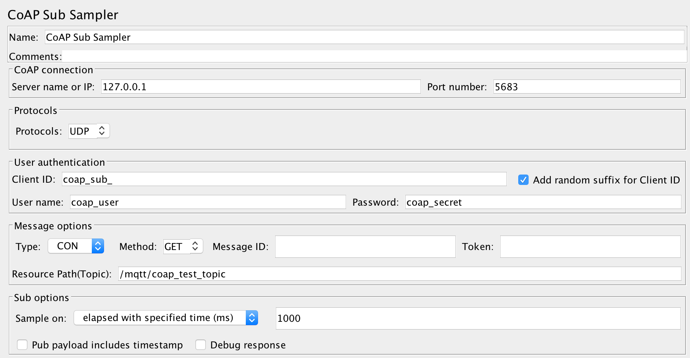
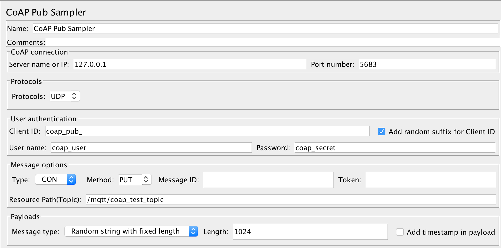

# coap-jmeter
CoAP JMeter Plugin, is used to test CoAP protocol. This plugin uses CoAP protocol to implement publishing and subscribing functions, with the purpose of communicating and executing the performance test with the CoAP server(emq_coap) in EMQ.

# Install instruction

This plugin is a maven project, and you can build it use the following command:
```
mvn install
```

After Maven building, please copy the jar file with suffix of '-jar-with-dependencies' into the $JMETER_HOME/lib/ext. Then restart the JMeter GUI, and two CoAP Samplers will appear in Sampler list.

# How to use
This plugin includes 2 samplers:
- CoAP Sub Sampler, subscribe to a topic to EMQ via CoAP server.
- CoAP Pub Sampler, publish message to a topic to EMQ via CoAP server.

These 2 samplers can be found under the Sampler panel shown as below:



## CoAP Sub Sampler


### CoAP connection
This section includes basic connection settings.

- **Server name or IP**: The CoAP server, often deployed as a plugin of EMQ, can be either IP address or server name. The default value is 127.0.0.1. **DO NOT** add protocol (e,g coap://) before server name or IP address! 

- **Port number**: The port that opens by CoAP server, the default value is 5683 for UDP protocol, and normally 5684 for SSL protocol.

### Protocols
The protocol type provided by the CoAP sampler is UDP and SSL. The default value is UDP.
Note that the SSL protocol is not supported yet by this plugin.

### User authentication
User can provide client ID, user name and password for authentication in CoAP server. 
And these three arguments will be encoded as Uri query, and can be refered to [EMQ CoAP subscribe example](https://github.com/emqtt/emq-coap/blob/master/README.md#subscribe-example).
- **Client ID**: the unique ID to distinguish a client, the default value is a prefix of 'coap_sub_'. And if you choose the 'Add random suffix for ClientId', the random generated suffix will be added.

- **User name**: the username for authentication, the default value is coap_user.

- **Password**: the password for authentication, the default value is coap_secret.

### Message options
This section provides some options of CoAP message.
- **Type**: represents the 'T' field in CoAP header, can either be CON or NON.
- **Method**: represents the 'Code' field in CoAP header, only 'GET' is allowed to do subscribing.
- **Message ID**: represents the 'Message ID' field in CoAP header, if blank, the sampler will generate automatically.
- **Token**: represents the 'Token' field in CoAP header, if blank, the sampler will generate automatically. And the maximum length of token is 8 byte.
- **Resource Path(Topic)**: the 'Uri-Path' option in CoAP message, the default value is '/mqtt/coap_test_topic'. Note that the prefix '/mqtt' is mandatory by CoAP server on EMQ, and the 'coap_test_topic' is the topic to be subscribed.

### Sub options
This section provides some specific options related to subscription.
- **Sample on**: It controls the frequency to collect test statistics and give out the sample result. 

  The default value is '**elapsed with specified time(ms)**', which means a sub sampler will wait a mount of time(ms) specified in next text field (default is 1000ms) before finish running. And during this period, all the received messages will be averagely summarized and recorded. Then after this period, the sample result will be given out. 

  Another option is '**received number of message**', which means a sub sampler will wait till the specified number of messages are received, the number is set in next text field (default is 1). If you choose the 'received number of message', you must be aware that the sampler will keep waiting if no such a mount of messages can be received, especially in UDP communications.
- **Debug response**: If checked, the received message will be print in response. It's recommended to enable it when you're debugging script.
- **Payload includes timestamp**: If checked, it assumes that the received payload includes a timestamp. It can be used to calculate the message latency time.


## CoAP Pub Sampler


### Payloads
- **Message type**: 3 types of message can be used. 

  + String: the normal string type. The input can also be a JMeter variable.

  + Hex string: the hex string type. The chars input must be [0-9] or [A-F] or [a-f]. The hex string will be converted to binary before sent to server. The input can also be a JMeter variable.
  
  + Random string with fixed length: the payload will be filled with random generated string. The 'Length' field means the payload string length in byte, the default value is 1024.

- **Add timestamp in payload**: Add timestamp in the payload or not. If the checkbox is enabled, the timestamp records when the payload is assembled will be added at the beginning of the payload. Mostly it can be used together with **CoAP Sub sampler** to calculate message latency time.


